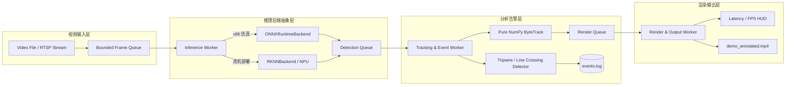

# EdgeVision-RK3588: 端侧多路智能视频分析盒子

[](#)
[-orange.svg)](#)
[](#)
[](#)

## 1. 项目简介
**EdgeVision-RK3588** 是一套专为瑞芯微 RK3588 旗舰端侧 AI 芯片量身打造的多路实时视频分析框架。
在硬件真机到货前，本项目在 **WSL2 (Ubuntu 22.04 LTS / x86_64)** 环境下完成了完整的算法转换、PTQ INT8 量化仿真、多线程生产者-消费者流水线构建、纯 NumPy 版 ByteTrack 目标跟踪器实现以及 C++ 交叉编译骨架工程。

系统具备 **"x86 仿真可跑，真机到货无缝切换"** 的工程特性：在 x86 上使用 `ONNXRuntimeBackend` 进行全流程仿真；当板卡就绪后，切换为 `RKNNBackend` / C++ 原生运行，即可瞬间跑满板载 6 TOPS 峰值 NPU 算力。

---

## 2. 系统流水线架构



---

## 3. 目录组织结构

```text
edgevision-rk3588/
├── convert/                    # 模型转换与量化模块
│   ├── export_onnx.py          # YOLOv8n -> ONNX (opset 12, 静态尺寸 640x640)
│   ├── prepare_calib.py        # PTQ 校准图像抽帧与校验 (50~100 张)
│   └── rknn_convert.py         # ONNX -> RKNN (INT8 / FP16) 转换器
├── simulate/                   # x86 仿真与量化评估
│   ├── simulator_eval.py       # RKNN Simulator 仿真脚本 (输出余弦相似度与误差分析)
│   └── simulation_report.md    # 仿真精度对比报告
├── pipeline/                   # 多线程实时视频分析流水线
│   ├── backend/
│   │   ├── base.py             # 统一推理后端基类 BaseBackend
│   │   ├── onnx_backend.py     # x86 CPU ONNXRuntime 实现
│   │   └── rknn_backend.py     # 板端 NPU (rknnlite / rknpu2) 实现与优雅 Stub
│   ├── latency_tracer.py       # 微秒级分段延迟剖析器 (p50/p95/p99/FPS)
│   ├── event_detector.py       # 电子围栏 / 越线报警触发器
│   ├── pipeline_engine.py      # 4 线程有界队列生产者-消费者流水线引擎
│   └── demo_pipeline.py        # 端到端命令行运行主入口
├── track/                      # 目标跟踪算法
│   ├── kalman_filter.py        # 纯 NumPy 2D 目标检测框卡尔曼滤波器
│   ├── basetrack.py            # 轨迹状态基类 (New, Tracked, Lost, Removed)
│   ├── byte_tracker.py         # ByteTrack 两阶段关联核心实现
│   └── test_tracker.py         # 跟踪器平滑、遮挡找回与交错运动单测
├── deploy/cpp/                 # C++ 高性能跨平台部署骨架
│   ├── 3rdparty/               # Rockchip 官方 rknn_api.h 与 librknnrt.so
│   ├── include/                # 头文件 (rknn_engine.h, postprocess.h)
│   ├── src/                    # 源码 (main.cpp, postprocess.cpp, rknn_engine.cpp)
│   ├── toolchain/              # aarch64 交叉编译 CMake 工具链
│   ├── build_x86.sh            # 本地编译脚本
│   ├── build_rk3588.sh         # 交叉编译推板脚本
│   └── CMakeLists.txt          # 支持 x86 本地编译与 aarch64 交叉编译
├── scripts/                    # 自动化脚本集
│   ├── setup_env.sh            # 极速一键建立 Python 3.10 venv 与官方依赖
│   ├── download_assets.sh      # 权重拉取与高拟真测试视频合成
│   ├── run_demo.sh             # 一键端到端运行多线程 Demo
│   ├── run_benchmark.sh        # 一键运行精度与吞吐基准测试
│   └── run_all_tests.sh        # 一键运行全系统自测套件
└── docs/                       # 项目文档体系
    ├── README.md               # 项目架构与快速上手指南
    ├── BENCHMARKS.md           # 性能与延迟基准数据表
    ├── STUDY_GUIDE.md          # 概念映射到代码位置的学习手册
    └── HANDOVER.md             # RK3588 板子到货后的保姆级交接清单
```

---

## 4. 快速上手指南 (WSL2 / x86)

### 4.1 环境初始化 (1 分钟)
```bash
git clone <your-repo> edgevision-rk3588
cd edgevision-rk3588

# 执行自动化配境脚本 (自动配置 Python 3.10 venv 并安装 rknn-toolkit2 官方 wheel)
bash scripts/setup_env.sh
```

### 4.2 准备模型与测试资产
```bash
# 下载 YOLOv8n 权重，合成包含车辆/行人的测试视频与校准图像集
bash scripts/download_assets.sh
```

### 4.3 转换模型为 RKNN INT8
```bash
# 导出 ONNX 并转换 RK3588 INT8 模型
.venv/bin/python convert/export_onnx.py
.venv/bin/python convert/rknn_convert.py
```

### 4.4 运行 x86 仿真精度评估
```bash
# 使用 RKNN 仿真器在 x86 上模拟 RK3588 NPU 数值行为
.venv/bin/python simulate/simulator_eval.py
```

### 4.5 启动多线程实时分析 Demo
```bash
# 运行端到端视频检测、ByteTrack 跟踪与越线事件报警
bash scripts/run_demo.sh
```
产出物：
- 输出带框、轨迹与 Latency HUD 的视频：`outputs/demo_annotated.mp4`
- 结构化越线告警日志：`outputs/events.log`

---

## 5. C++ 部署编译指南
```bash
cd deploy/cpp

# 1. 下载 RK3588 官方 C 动态库与头文件
bash 3rdparty/download_rknn_libs.sh

# 2. 本地 x86 构建与运行
bash build_x86.sh
./build/edgevision_x86

# 3. 交叉编译为 RK3588 aarch64 可执行程序 (真机就绪后执行)
bash build_rk3588.sh
```
